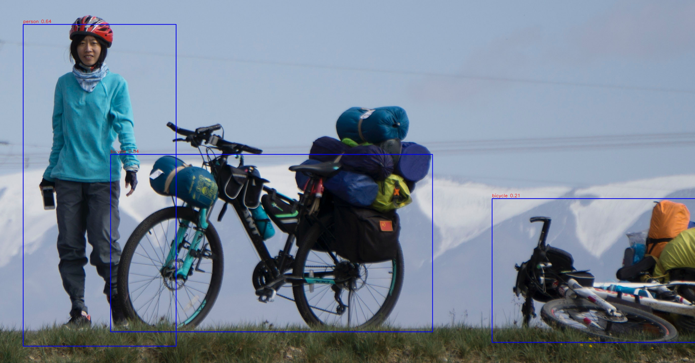
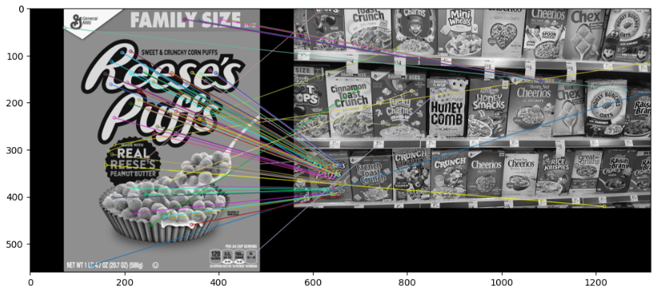

# Course_OpenCV

## Info

Repository contains a course files with small computer vision project. I have learned a lot about how computer vision and deep learning for cv works.
Knowledge:
- Computer Vision theory
- Deep learning for CV theory
- Python
- Keras, tensoflow
- OpenCV

## Capstone project - finger count

